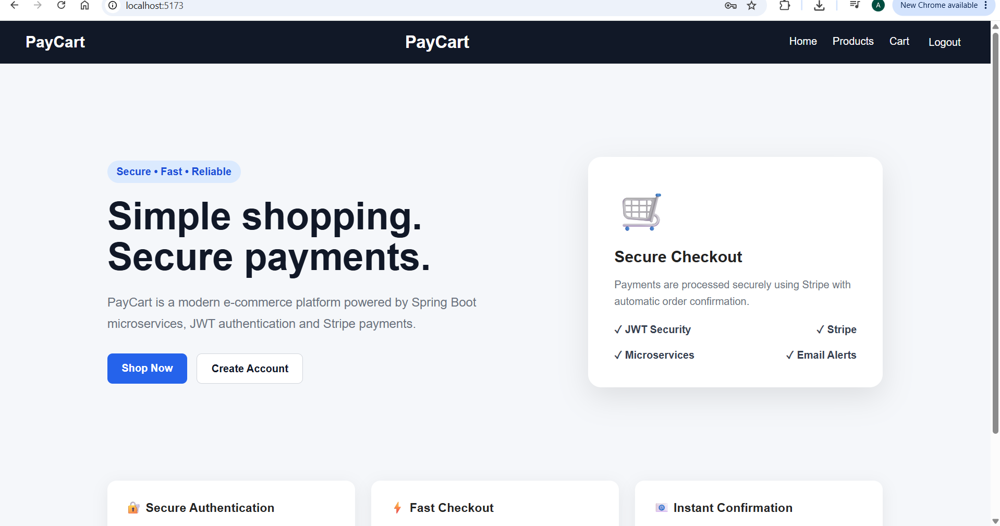
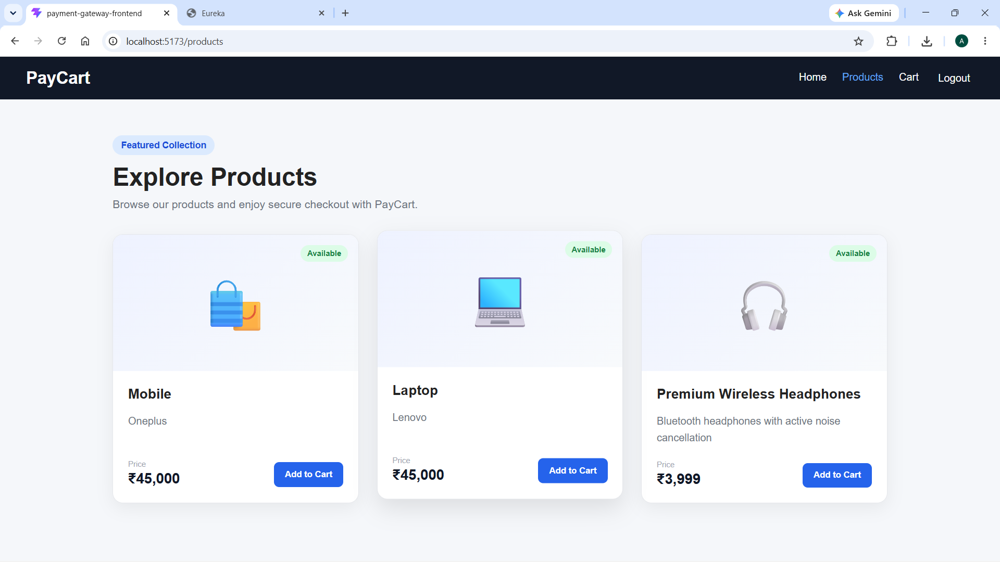
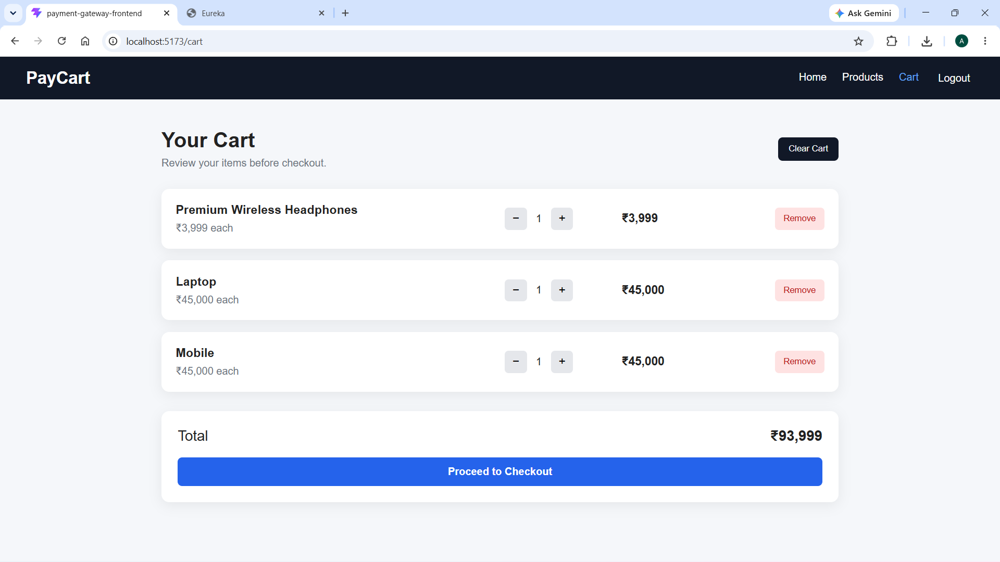
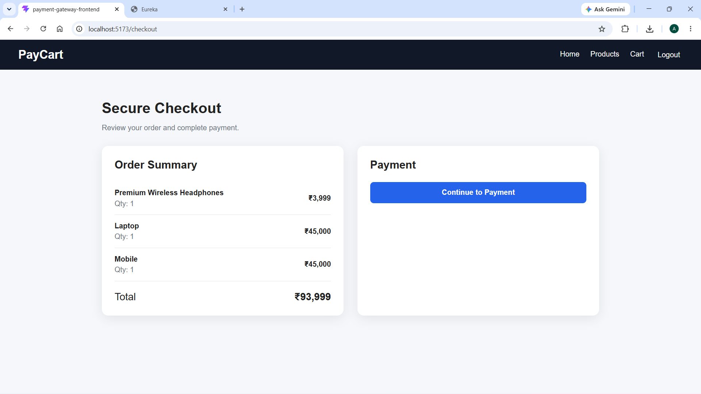
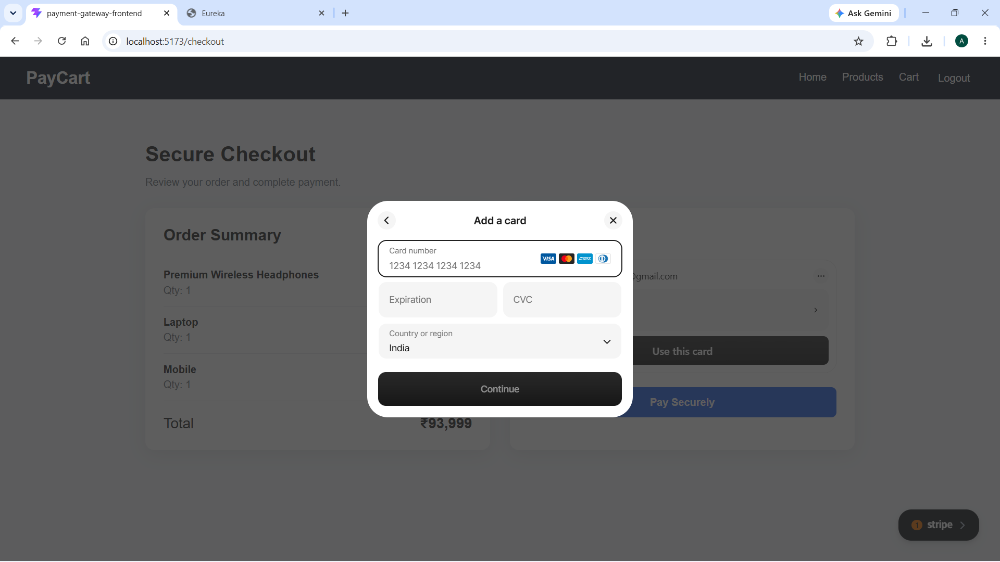
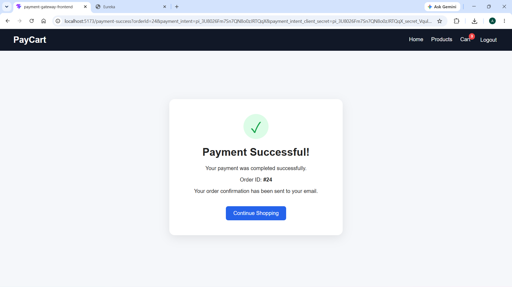
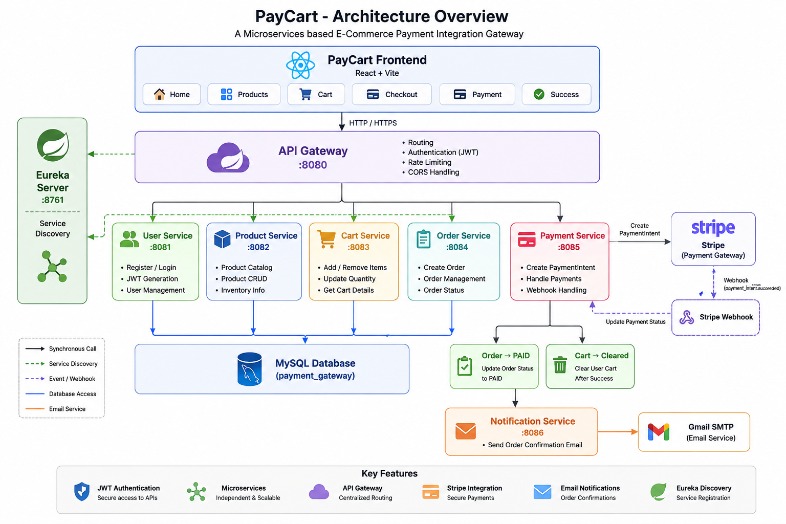

# 🛒 PayCart – Payment Integration Gateway

A full-stack e-commerce payment platform built using **Spring Boot Microservices, React, MySQL, JWT Authentication, Stripe Payments, Eureka Service Discovery, and REST APIs**.

PayCart demonstrates a complete online shopping and payment workflow — from user authentication and product browsing to cart management, secure Stripe payment processing, order confirmation, automatic cart clearing, and email notifications.

## ✨ Key Features

- 🔐 JWT-based user authentication
- 🛍️ Product browsing and cart management
- ➕ Add, remove and update cart quantities
- 📦 Automatic order creation
- 💳 Secure Stripe payment integration
- 🔔 Stripe webhook-based payment verification
- ✅ Automatic order status update after successful payment
- 🧹 Automatic cart clearing after payment
- 📧 Email confirmation after successful payment
- 🔎 Eureka service discovery
- 🚪 Centralized API Gateway
- ⚛️ Responsive React frontend
- 🗄️ MySQL database persistence

## 🛠️ Tech Stack

| Category | Technologies |
|---|---|
| Backend | Java, Spring Boot |
| Frontend | React, Vite, JavaScript, HTML, CSS |
| Database | MySQL |
| Authentication | JWT |
| Payment Gateway | Stripe |
| Service Discovery | Netflix Eureka |
| API Gateway | Spring Cloud Gateway |
| Communication | REST APIs |
| Email | Spring Mail |
| Build Tool | Maven |
| Version Control | Git & GitHub |

### Frontend
- React
- Vite
- Axios
- React Router
- Stripe React SDK

## 🧩 Microservices

| Service | Responsibility |
|---|---|
| API Gateway | Central entry point for backend APIs |
| Eureka Server | Service registration and discovery |
| User Service | Registration, login and JWT authentication |
| Product Service | Product management and retrieval |
| Cart Service | Shopping cart and quantity management |
| Order Service | Order creation and status management |
| Payment Service | Stripe PaymentIntent and webhook processing |
| Notification Service | Sends payment confirmation emails |

## 🔗 API Endpoints

### User Service
| Method | Endpoint | Description |
|---|---|---|
| POST | `/api/users/register` | Register a new user |
| POST | `/api/users/login` | Authenticate user and return JWT |

### Product Service
| Method | Endpoint | Description |
|---|---|---|
| GET | `/api/products` | Get all products |
| GET | `/api/products/{id}` | Get product by ID |
| POST | `/api/products` | Create a product |
| PUT | `/api/products/{id}` | Update a product |
| DELETE | `/api/products/{id}` | Delete a product |

### Cart Service
| Method | Endpoint | Description |
|---|---|---|
| GET | `/api/cart` | Get current user's cart |
| POST | `/api/cart/add` | Add product to cart |
| PUT | `/api/cart/update/{itemId}` | Update item quantity |
| DELETE | `/api/cart/remove/{itemId}` | Remove item from cart |
| DELETE | `/api/cart/clear` | Clear current user's cart |

### Order Service
| Method | Endpoint | Description |
|---|---|---|
| POST | `/api/orders` | Create order from current cart |
| GET | `/api/orders` | Get user's orders |
| GET | `/api/orders/{orderId}` | Get order by ID |

### Payment Service
| Method | Endpoint | Description |
|---|---|---|
| POST | `/api/payments` | Create Stripe PaymentIntent |
| GET | `/api/payments` | Get payment information |
| POST | `/api/payments/webhook` | Receive Stripe webhook events |

### Notification Service
| Method | Endpoint | Description |
|---|---|---|
| POST | `/api/notifications` | Create and send notification email |

> Protected endpoints require a JWT Bearer token through the `Authorization` header.

## Architecture

React Frontend
      ↓
API Gateway
      ↓
┌─────────────┬──────────────┬─────────────┐
↓             ↓              ↓
User       Product         Cart
                              ↓
                           Order
                              ↓
                          Payment
                              ↓
                           Stripe
                              ↓
                           Webhook
                    ┌─────────┴─────────┐
                    ↓                   ↓
               Order → PAID       Cart → Cleared
                                        ↓
                               Notification Service
                                        ↓
                                  Gmail / Email

Envirornment Variables
======================

MYSQL_PASSWORD
JWT_SECRET
STRIPE_SECRET_KEY
STRIPE_WEBHOOK_SECRET
MAIL_USERNAME
MAIL_APP_PASSWORD
VITE_STRIPE_PUBLISHABLE_KEY 

Stripe Listen 
=============
stripe listen --forward-to http://localhost:8085/api/payments/webhook

## 📸 Application Screenshots

### Home Page

### Products Page

### Shopping Cart

### Checkout Page

### Stripe Secure Checkout

### Payment Successful

## 🏗️ System Architecture

 